# Présentation du projet exo-bank-Java

**Ce projet est un projet de cours basé sur un exemple de cours, il a pour objectif de nous présenter les micro-services en JAVA.**

**Je dois créer 3 services : Account / Card / Loan**

**Ensuite, créer un service discovery / gateway / config-server**

## Création des services

Dans la création d'un service, on crée un projet **Maven** via **SpringBoot**

### Création du service *Account*

#### Création 
Pour la création du service **Account**, il faut utiliser les **Dépendances** suivantes :

- Spring Data JPA
- H2 Database
- Lombok
- Spring Web
- Spring Boot Dev Tools  

Pour appliquer directement les dépendances, on peut utiliser le site suivant :
https://start.spring.io/index.html

**ou**

Via **IJ**, on peut créer un projet avec les dépendances directement.

Une fois le projet crée, on envoie un premier commit de création du service : **Account**

**Account** :     
- private Long id;
- private String name;
- private String email;
- private Integer solde; 

#### Création du fichier *Entity*

On crée d'abord un package **Entity**, pour créer la class : *Account.java*

##### Entity : 

```Java
package org.example.accountservice.entity;
import jakarta.persistence.*;
import lombok.AllArgsConstructor;
import lombok.Data;
import lombok.NoArgsConstructor;

@AllArgsConstructor
@NoArgsConstructor
@Entity
@Table(name = "accounts")
public class Account {
    @Id
    @GeneratedValue(strategy = GenerationType.IDENTITY)
    private Long id;
    private String name;
    private String email;
    private Integer Solde;

    public Long getId() {
        return id;
    }

    public void setId(Long id) {
        this.id = id;
    }

    public String getName() {
        return name;
    }

    public void setName(String name) {
        this.name = name;
    }

    public String getEmail() {
        return email;
    }

    public void setEmail(String email) {
        this.email = email;
    }

    public Integer getSolde() {
        return Solde;
    }

    public void setSolde(Integer solde) {
        Solde = solde;
    }
    
}

```
Ensuite, on crée un package **Repository**, pour créer l'interface : *AccountRepository.java*

##### Repository :
```Java
package org.example.account.repository;

import org.example.account.entity.Account;
import org.springframework.data.jpa.repository.JpaRepository;

public interface AccountRepository extends JpaRepository<Account, Integer> {
    
}

```

Ensuite, on crée un package **Service**, pour créer l'interface : *AccountService.java*

##### Service :
```Java
package org.example.account.service;

import org.example.account.entity.Account;

import java.util.List;

public interface AccountService {
    public List<Account> getAllAccounts();

    public Account getAccountById(Long id);

    public Account saveAccount(Account account);

    public void deleteAccount(Long id);
}
```

Ensuite, on crée un package **ServiceImpl**, pour créer l'interface : *AccountServiceImpl.java*

##### ServiceImpl :
```Java
package org.example.account.serviceImpl;

import org.example.account.entity.Account;
import org.example.account.repository.AccountRepository;
import org.example.account.service.AccountService;
import org.springframework.beans.factory.annotation.Autowired;
import org.springframework.stereotype.Service;

import java.util.List;

@Service
public class AccountServiceImpl implements AccountService {

    @Autowired
    private AccountRepository accountRepository;

    @Override
    public List<Account> getAllAccounts() {
        return accountRepository.findAll();
    }

    @Override
    public Account getAccountById(Long id) {
        return accountRepository.findById(id).orElseThrow(() -> new RuntimeException("Account not found"));
    }

    @Override
    public Account saveAccount(Account account) {
        return accountRepository.save(account);
    }

    @Override
    public void deleteAccount(Long id) {
        accountRepository.deleteById(id);
    }
}
```


Ensuite, on crée un package **Controller**, pour créer l'interface : *AccountController.java*

##### Controller :
```Java
package org.example.account.controller;

import org.example.account.entity.Account;
import org.example.account.service.AccountService;
import org.springframework.beans.factory.annotation.Autowired;
import org.springframework.web.bind.annotation.*;

import java.util.List;

@RestController
@RequestMapping("/accounts")
public class AccountController {

    @Autowired
    private AccountService accountService;

    @GetMapping
    public List<Account> getAllAccounts() {
        return accountService.getAllAccounts();
    }

    @GetMapping("/{id}")
    public Account getAccountById(@PathVariable Long id) {
        return accountService.getAccountById(id);
    }

    @PostMapping
    public Account createAccount(@RequestBody Account account) {
        System.out.println(account.getName());
        return accountService.saveAccount(account);
    }

    @DeleteMapping("/{id}")
    public void deleteAccount(@PathVariable Long id) {
        accountService.deleteAccount(id);
    }

}
```

Après avoir créé tous ses fichiers, je peux maintenant tester si mon service fonctionne en utilisant les routes

Après avoir lancé **Postman**, on peut tester l'url suivante : 

```URL
http://localhost:8080/accounts
```

Avec ce Json par exemple :

```json
{
    "name": "thomas",
    "email": "thomas@ynov.com",
    "solde": 10
}
```
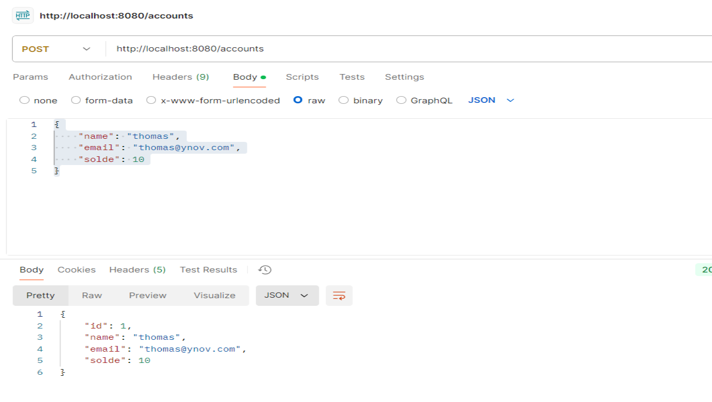
On peut voir ici que la création a bien été effectué, on peut vérifier également avec l'usage d'un getAll et/ou d'un getById.

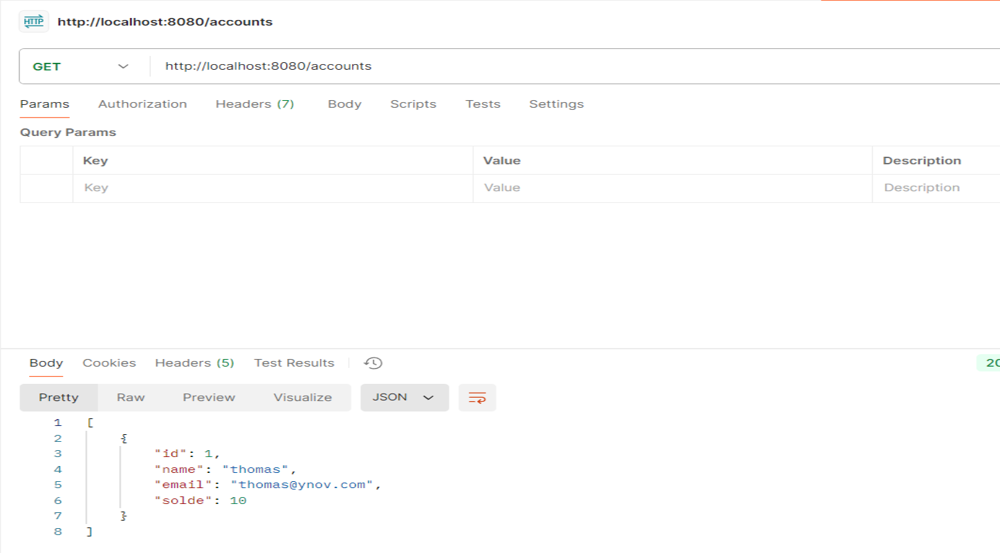
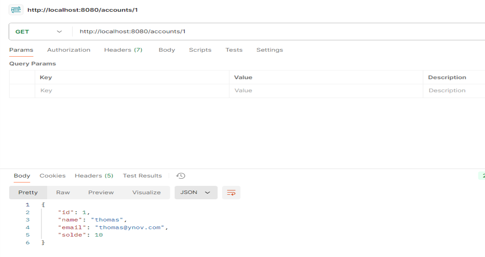

On peut également tester la suppression : 

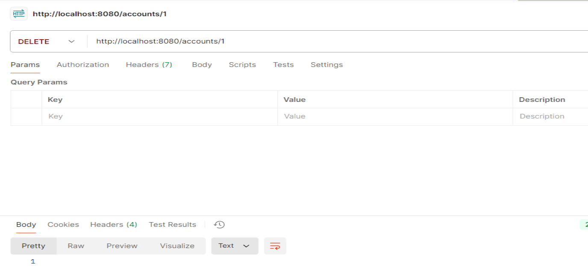
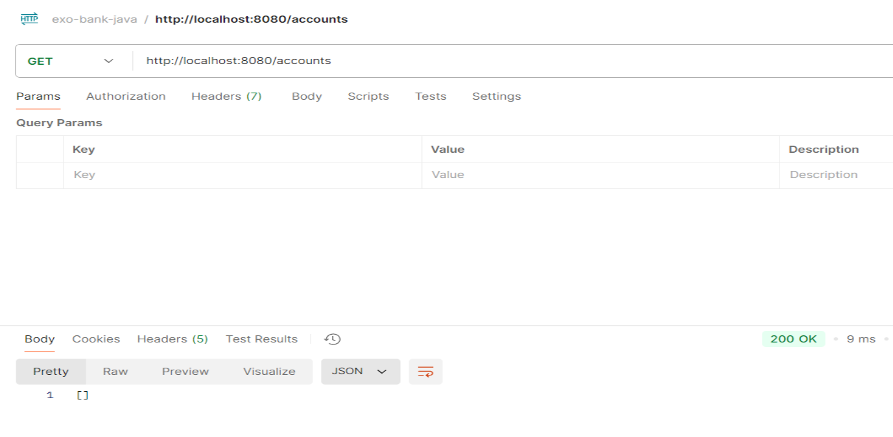

Une fois que tous fonctionne, on peut maintenant passer au deux autres services : **Card** et **Loan**

Avant cela, on peut maintenant faire un commit pour la creation final du service account

### Création du service *Card*

#### Création
Pour la création du service **Card**, il faut utiliser les **Dépendances** suivantes :

- Spring Data JPA
- H2 Database
- Lombok
- Spring Web
- Spring Boot Dev Tools  

**Card** :
- private Long id;
- private String cardNumber;
- private String cardType;
- private Long accountId;


#### Création du fichier *Entity*

On crée d'abord un package **Entity**, pour créer la class : *Card.java*

##### Entity :

```Java
package org.example.card.entity;

import jakarta.persistence.*;
import lombok.AllArgsConstructor;
import lombok.Data;
import lombok.NoArgsConstructor;

@Data
@NoArgsConstructor
@AllArgsConstructor
@Entity
@Table(name = "cards")
public class Card {
    @Id
    @GeneratedValue(strategy = GenerationType.IDENTITY)
    private Long id;

    private String cardNumber;
    private String cardType;
    private Long accountId;

    public Long getId() {
        return id;
    }

    public void setId(Long id) {
        this.id = id;
    }

    public String getCardNumber() {
        return cardNumber;
    }

    public void setCardNumber(String cardNumber) {
        this.cardNumber = cardNumber;
    }

    public String getCardType() {
        return cardType;
    }

    public void setCardType(String cardType) {
        this.cardType = cardType;
    }

    public Long getAccountId() {
        return accountId;
    }

    public void setAccountId(Long accountId) {
        this.accountId = accountId;
    }
}
```
Ensuite, on crée un package **Repository**, pour créer l'interface : *CardRepository.java*

##### Repository :
```Java
package org.example.card.repository;

import org.example.card.entity.Card;
import org.springframework.data.jpa.repository.JpaRepository;

public interface CardRepository extends JpaRepository<Card, Long> {
}
```

Ensuite, on crée un package **Service**, pour créer l'interface : *CardService.java*

##### Service :
```Java
package org.example.card.service;

import org.example.card.entity.Card;

import java.util.List;

public interface CardService {
    public List<Card> getAllCards();

    public Card getCardById(Long id);

    public Card saveCard(Card card);

    public void deleteCard(Long id);
}
```


Ensuite, on crée un package **ServiceImpl**, pour créer l'interface : *CardServiceImpl.java*

##### ServiceImpl :
```Java
package org.example.card.serviceImpl;

import org.example.card.entity.Card;
import org.example.card.repository.CardRepository;
import org.example.card.service.CardService;
import org.springframework.beans.factory.annotation.Autowired;
import org.springframework.stereotype.Service;

import java.util.List;

@Service
public class CardServiceImpl implements CardService {

    @Autowired
    private CardRepository cardRepository;

    @Override
    public List<Card> getAllCards() {
        return cardRepository.findAll();
    }

    @Override
    public Card getCardById(Long id) {
        return cardRepository.findById(id).orElseThrow(() -> new RuntimeException("Card not found"));
    }

    @Override
    public Card saveCard(Card card) {
        return cardRepository.save(card);
    }

    @Override
    public void deleteCard(Long id) {
        cardRepository.deleteById(id);
    }
}
```


Ensuite, on crée un package **Controller**, pour créer l'interface : *CardController.java*

##### Controller :
```Java
package org.example.card.controller;

import org.example.card.entity.Card;
import org.example.card.service.CardService;
import org.springframework.beans.factory.annotation.Autowired;
import org.springframework.web.bind.annotation.*;

import java.util.List;

@RestController
@RequestMapping("/cards")
public class CardController {
    @Autowired
    private CardService cardService;

    @GetMapping
    public List<Card> getAllCards() {
        return cardService.getAllCards();
    }

    @GetMapping("/{id}")
    public Card getCardById(@PathVariable Long id) {
        return cardService.getCardById(id);
    }

    @PostMapping
    public Card createCard(@RequestBody Card card) {
        System.out.println(card);
        return cardService.saveCard(card);
    }

    @DeleteMapping("/{id}")
    public void deleteCard(@PathVariable Long id) {
        cardService.deleteCard(id);
    }
}
```
Après avoir créé tous ses fichiers, je peux maintenant tester si mon service fonctionne en utilisant les routes de Card

On peut tester l'url suivante :

```URL
http://localhost:8080/cards
```

Avec ce Json par exemple :

```json
{
  "cardNumber": "1234567812345678",
  "cardType": "Visa",
  "accountId": 1
}
```
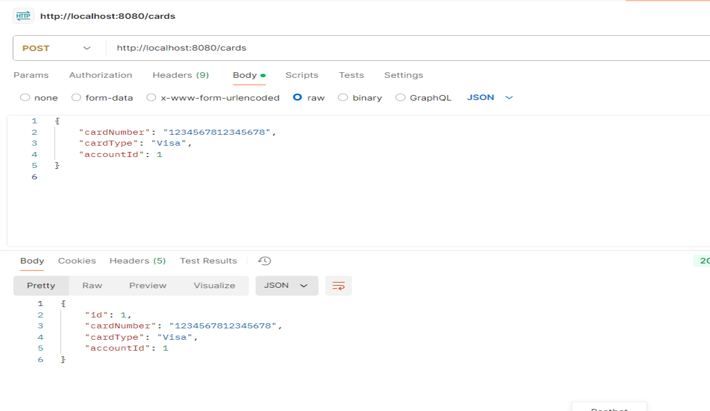
On peut voir ici que la création a bien été effectué, on peut vérifier également avec l'usage d'un getAll et/ou d'un getById.

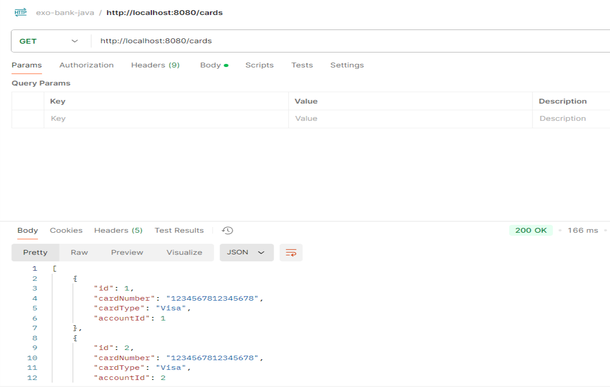
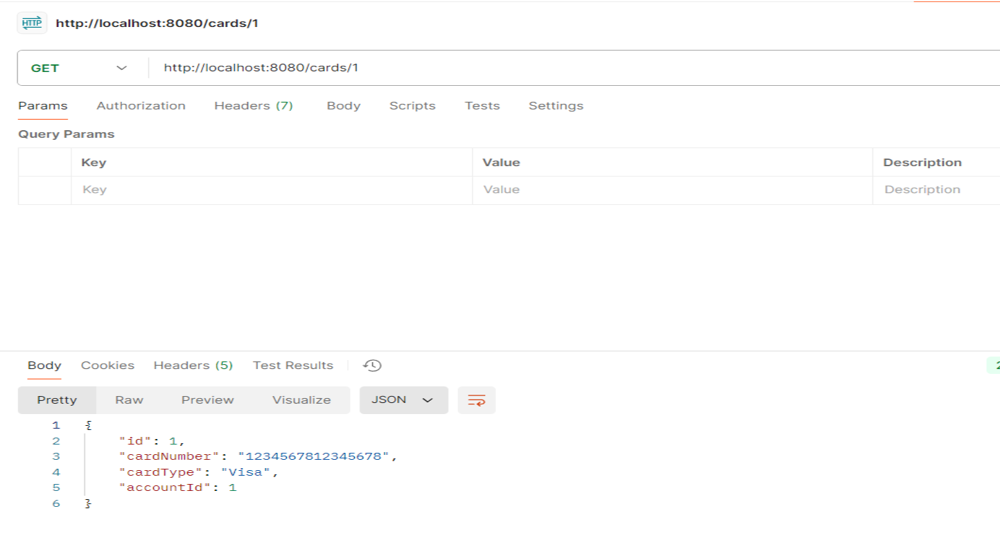

On peut également tester la suppression :

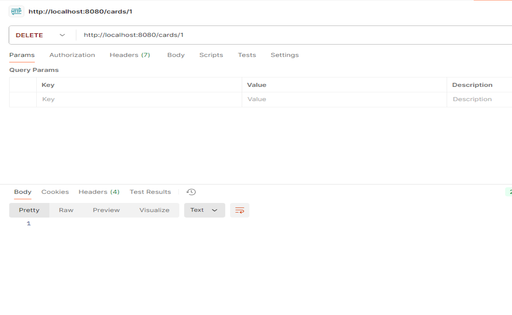
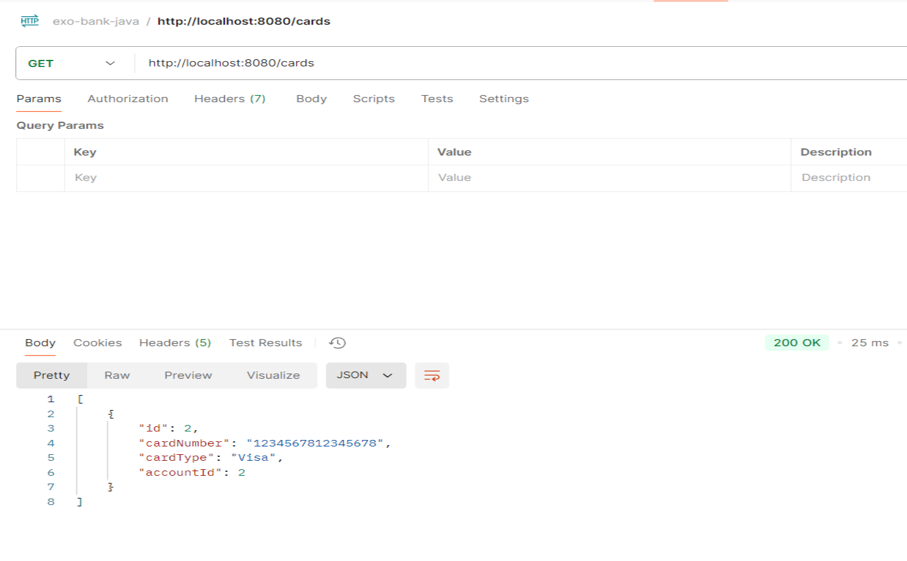

Dans ce cas-ci, il n'y a pas la vérification de **Account** lors de la création d'une **Card**, cette vérification sera faite plus tard.

On peut maintenant faire un commit pour la creation final du service card

### Création du service *Loan*

#### Création
Pour la création du service **Loan**, il faut utiliser les **Dépendances** suivantes :

- Spring Data JPA
- H2 Database
- Lombok
- Spring Web
- Spring Boot Dev Tools

**Loan** :
- private Long id;
- private Double amount;
- private String type;
- private Long accountId;

#### Création du fichier *Entity*

On crée d'abord un package **Entity**, pour créer la class : *Loan.java*

##### Entity :
```java
package org.example.loan.entity;

import jakarta.persistence.*;
import lombok.AllArgsConstructor;
import lombok.Data;
import lombok.NoArgsConstructor;

@Data
@AllArgsConstructor
@NoArgsConstructor
@Entity
@Table(name = "loans")
public class Loan {
    @Id
    @GeneratedValue(strategy = GenerationType.IDENTITY)
    private Long id;

    private Double amount;
    private String type;
    private Long accountId;

    public Long getId() {
        return id;
    }

    public void setId(Long id) {
        this.id = id;
    }

    public Double getAmount() {
        return amount;
    }

    public void setAmount(Double amount) {
        this.amount = amount;
    }

    public String getType() {
        return type;
    }

    public void setType(String type) {
        this.type = type;
    }

    public Long getAccountId() {
        return accountId;
    }

    public void setAccountId(Long accountId) {
        this.accountId = accountId;
    }
}
```

Ensuite, on crée un package **Repository**, pour créer l'interface : *LoanRepository.java*

##### Repository :
```Java
package org.example.loan.repository;

import org.example.loan.entity.Loan;
import org.springframework.data.jpa.repository.JpaRepository;

public interface LoanRepository extends JpaRepository<Loan, Long> {
}

```

Ensuite, on crée un package **Service**, pour créer l'interface : *LoanService.java*

##### Service :
```Java
package org.example.loan.service;

import org.example.loan.entity.Loan;

import java.util.List;

public interface LoanService {

    public List<Loan> getAllLoans();

    public Loan getLoanById(Long id);

    public Loan saveLoan(Loan loan);

    public void deleteLoan(Long id);
}
```


Ensuite, on crée un package **ServiceImpl**, pour créer l'interface : *LoanServiceImpl.java*

##### ServiceImpl :
```Java
package org.example.loan.serviceImpl;

import org.example.loan.entity.Loan;
import org.example.loan.repository.LoanRepository;
import org.example.loan.service.LoanService;
import org.springframework.beans.factory.annotation.Autowired;
import org.springframework.stereotype.Service;

import java.util.List;

@Service
public class LoanServiceImpl implements LoanService {

    @Autowired
    private LoanRepository loanRepository;

    @Override
    public List<Loan> getAllLoans() {
        return loanRepository.findAll();
    }

    @Override
    public Loan getLoanById(Long id) {
        return loanRepository.findById(id).orElseThrow(() -> new RuntimeException("Loan not found"));
    }

    @Override
    public Loan saveLoan(Loan loan) {
        return loanRepository.save(loan);
    }

    @Override
    public void deleteLoan(Long id) {
        loanRepository.deleteById(id);
    }
}
```

Ensuite, on crée un package **Controller**, pour créer l'interface : *LoanController.java*

##### Controller :
```Java
package org.example.loan.controller;


import org.example.loan.entity.Loan;
import org.example.loan.service.LoanService;
import org.springframework.beans.factory.annotation.Autowired;
import org.springframework.web.bind.annotation.*;

import java.util.List;

@RestController
@RequestMapping("/loans")
public class LoanController {

    @Autowired
    private LoanService loanService;

    @GetMapping
    public List<Loan> getAllLoans() {
        return loanService.getAllLoans();
    }

    @GetMapping("/{id}")
    public Loan getLoanById(@PathVariable Long id) {
        return loanService.getLoanById(id);
    }

    @PostMapping
    public Loan createLoan(@RequestBody Loan loan) {
        System.out.println(loan);
        return loanService.saveLoan(loan);
    }

    @DeleteMapping("/{id}")
    public void deleteLoan(@PathVariable Long id) {
        loanService.deleteLoan(id);
    }
}
```
Après avoir créé tous ses fichiers, je peux maintenant tester si mon service fonctionne en utilisant les routes de Loan


On peut tester l'url suivante :

```URL
http://localhost:8080/loans
```

Avec ce Json par exemple :

```json
{
  "amount": 10000.0,
  "type": "personnel",
  "accountId": 1
}
```

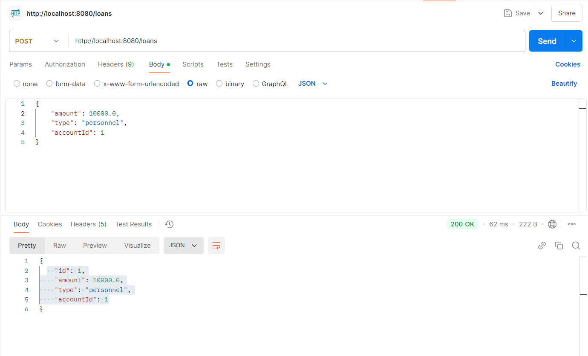
On peut voir ici que la création a bien été effectué, on peut vérifier également avec l'usage d'un getAll et/ou d'un getById.

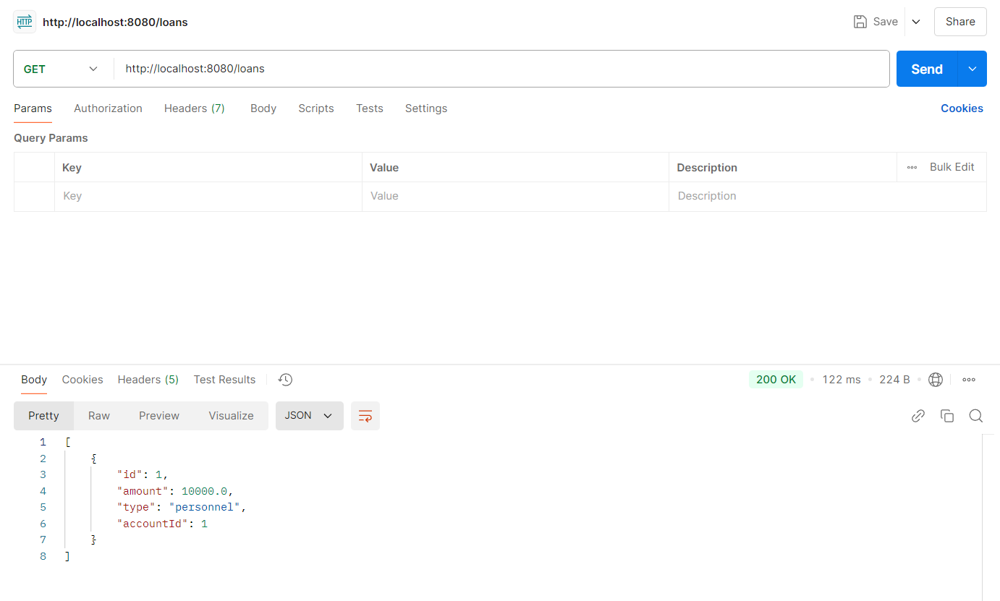
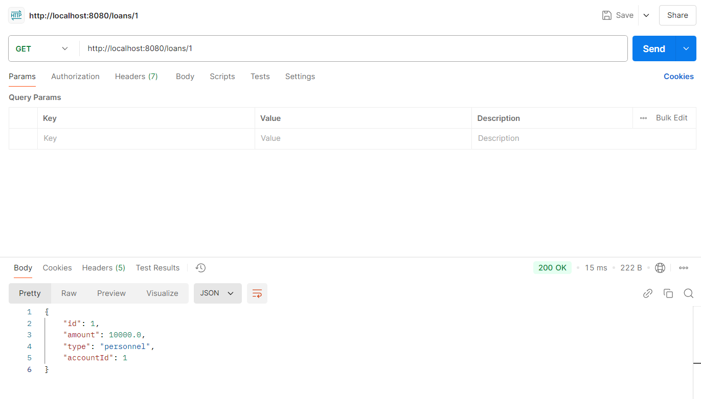

On peut également tester la suppression :

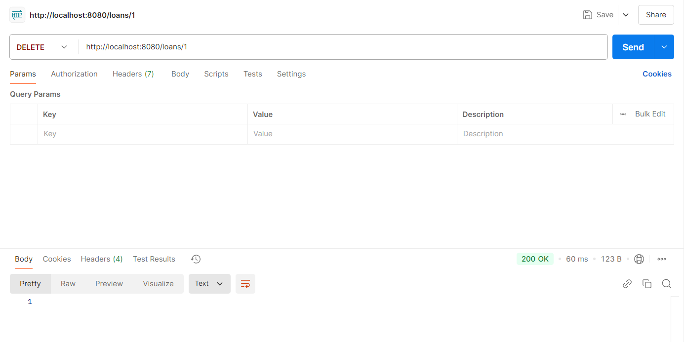
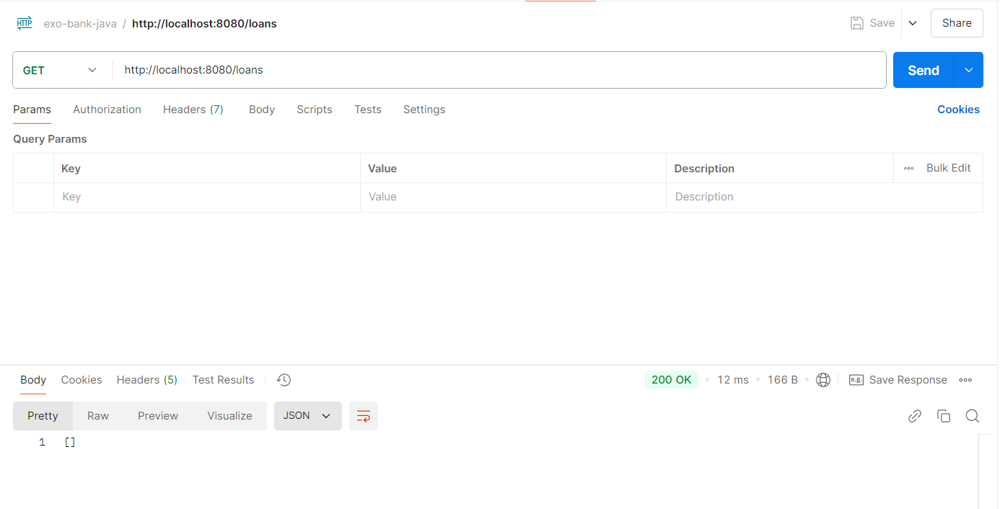

Dans ce cas-ci, il n'y a pas la vérification de **Account** lors de la création d'une **Loan**, cette vérification sera faite plus tard.

On peut maintenant faire un commit pour la creation final du service loan

Après avoir créé tous les services de base, on va maintenant créer les services de **Discovery** et **Gateway**

### Création *Discovery*

Il faut utiliser les **Dépendances** suivantes :

- Eureka server
- Spring server
- spring web
- devtool

Dans le DiscoveryServiceApplication

- importer @EnableEurekaServer

```Java
package com.example.discovery;

import org.springframework.boot.SpringApplication;
import org.springframework.boot.autoconfigure.SpringBootApplication;
import org.springframework.cloud.netflix.eureka.server.EnableEurekaServer;

@SpringBootApplication
@EnableEurekaServer
public class DiscoveryApplication {

	public static void main(String[] args) {
		SpringApplication.run(DiscoveryApplication.class, args);
	}

}
```

Renommez **l'application.properties** en **application.yml**
Dans l'application.yml, ajoutez le code suivant :
```yml
server:
  port:8761
  
eureka:
  client:
    register-with-eureka: false
    fetch-registry: false
```

On vérifie si le service se lance bien sur le port 8761

### Création **api-gateway**

Il faut utiliser les **Dépendances** suivantes :

- Eureka discovery server
- gateway
- spring web

Vérifier si le pom.cml contient les dépendances suivantes :

```xml
<dependency>
    <groupId>org.springframework.boot</groupId>
    <artifactId>spring-boot-starter</artifactId>
</dependency>
<dependency>
    <groupId>org.springframework.cloud</groupId>
    <artifactId>spring-cloud-starter-gateway</artifactId>
</dependency>
<dependency>
    <groupId>org.springframework.cloud</groupId>
    <artifactId>spring-cloud-starter-netflix-eureka-client</artifactId>
</dependency>
```

Renommez **l'application.properties** en **application.yml**

Dans l'application.yml, ajoutez le code suivant :

```yml
server:
  port: 8090

spring:
  application:
    name: api-gateway
  cloud:
    gateway:
      routes:
        - id: account
          uri: lb://account
          predicates:
            - Path=/accounts/**
        - id: card
          uri: lb://card
          predicates:
            - Path=/cards/**
        - id: loan
          uri: lb://loan
          predicates:
            - Path=/loans/**
eureka:
  client:
    service-url:
      defaultZone: http://localhost:8761/eureka/
    initial-instance-info-replication-interval-seconds: 10
    register-with-eureka: true
    fetch-registry: true
  instance:
    prefer-ip-address: true
    instance-id: api-gateway:${server.port}
```

Cette configuration configure un API Gateway avec Spring Cloud Gateway, 
qui agit comme un point d'entrée pour les requêtes HTTP. 
Il redirige les requêtes vers les services appropriés (account, card, loan) en fonction des URL. 
L'API Gateway s'enregistre également auprès du serveur Eureka pour que d'autres services puissent le découvrir et y accéder. 
Il récupère aussi la liste des services enregistrés dans Eureka pour rediriger les requêtes vers les services correspondants.

**Maintenant, pour appliquer correctement la gateway sur les différents services (Account / Card / Loan), il faut modifier les fichiers properties de chaque service.**

### Modification des services

#### Modification : *Account*

Renommez **l'application.properties** en **application.yml**

Ajoutez le code suivant :

```yml
server:
  port: 8081
spring:
  application:
    name: account
  datasource:
    url: jdbc:h2:mem:testdb
    driverClassName: org.h2.Driver
    username: sa
    password:
  h2:
    console:
      enabled: true
      path: /h2-console
  jpa:
    database-platform: org.hibernate.dialect.H2Dialect
    show-sql: true
    hibernate:
      ddl-auto: update
eureka:
  client:
    service-url:
      defaultZone: http://localhost:8761/eureka/
    register-with-eureka: true
    fetch-registry: true
```

Cette configuration définit une application Spring Boot avec une base de données H2 en mémoire, une console H2 activée, et une connexion à Eureka pour la découverte de services. L'application account écoute sur le port 8081, utilise JPA avec Hibernate pour interagir avec la base de données, et se connecte à un serveur Eureka pour s'enregistrer et découvrir d'autres services.

**En parallèle, on update le *pom.xlm* de Account.**

On y ajoute la ligne suivante :
```xml
<spring-cloud.version>2024.0.0</spring-cloud.version>
```

Dans les **properties** :
```xml
<properties>
    <java.version>17</java.version>
    <spring-cloud.version>2024.0.0</spring-cloud.version>
</properties>
```

On ajoute également les lignes suivantes dans les **dependencies** :
Pour la dépendance eureka-client 
```xml
<dependency>
    <groupId>org.springframework.cloud</groupId>
    <artifactId>spring-cloud-starter-netflix-eureka-client</artifactId>
</dependency>
```

**SANS OUBLIER :**

D'ajouter les lignes suivantes après la partie **dependencies** : 

```xml
<dependencyManagement>
    <dependencies>
        <dependency>
            <groupId>org.springframework.cloud</groupId>
            <artifactId>spring-cloud-dependencies</artifactId>
            <version>${spring-cloud.version}</version>
            <type>pom</type>
            <scope>import</scope>
        </dependency>
    </dependencies>
</dependencyManagement>
```

Après avoir appliqué ça pour **Account**, il faut faire la même chose avec **Card** et **Loan**

La seule modification sera le port utilisé :

Dans l' **application.yml** de **Card** on aura :

```yml
server:
  port: 8082
```

**ET**

Dans l' **application.yml** de **Loan** on aura :

```yml
server:
  port: 8083
```

On peut maintenant tester si les services se lancent bien et si les URL des services Account / Loan / Card pointent bien sur les URL données et sur le Discovery-service.

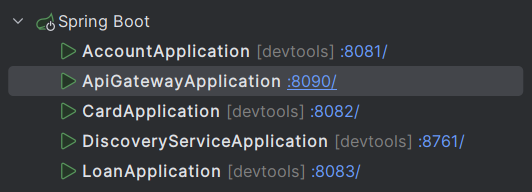

On peut faire un commit sur la création du Discovery-service, api-gateway et la modification des services.

### Création du service *config-server*

Pour la création du service *config-server*, il faut dans un premier temps crée un repository git *config-server* dans lequel on va créer des fichiers *yml* pour chaque service.

La première étape est de créer un repo git :

Création du repo : config-server-exo-bank

Ensuite, on crée des fichiers yml pour chaque service, comme ci-dessous :

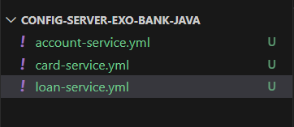

Ensuite, on ajoute dans chaque fichier le code suivant :

```yml
server:
  port: 8081
spring:
  application:
    name: account
  datasource:
    url: jdbc:h2:mem:testdb
    driverClassName: org.h2.Driver
    username: sa
    password:
  h2:
    console:
      enabled: true
      path: /h2-console
  jpa:
    database-platform: org.hibernate.dialect.H2Dialect
    show-sql: true
    hibernate:
      ddl-auto: update
eureka:
  client:
    service-url:
      defaultZone: http://localhost:8761/eureka/
    register-with-eureka: true
    fetch-registry: true
```

Ne pas oublier de changer le **port** et le **name-application** de chaque fichier.

Après avoir fait ça, on peut push le contenu et ensuite passer à l'étape de création du service **Config-server** dans le repo de base.

Donc, on va créer un service **Config-server**, avec les dépendances suivantes :

- Spring web
- spring cloud config server
- devtools

#### importation de EnableConfigServer

On va venir importer :

```Java
@EnableConfigServer
```

Dans le **ConfigServerApplication**, ce qui donne ceci : 

```Java
package org.example.configserver;

import org.springframework.boot.SpringApplication;
import org.springframework.boot.autoconfigure.SpringBootApplication;
import org.springframework.cloud.config.server.EnableConfigServer;

@SpringBootApplication
@EnableConfigServer
public class ConfigServerApplication {
    public static void main(String[] args) {
        SpringApplication.run(ConfigServerApplication.class, args);
    }
}
```

#### Changement de l'application.yml

Renommez **l'application.properties** en **application.yml**

Ajoutez le code suivant :

```yml
server:
  port: 8880

spring:
  application:
    name: config-server
  cloud:
    config:
      server:
        git:
          uri: https://github.com/LumyaZ/config-server-exo-bank-java.git
          default-label: master
```

Les deux parties importantes sont :

- le **port**
- l'url du git qui doit être celui du **config-server** créé juste avant.

Après cela, on peut faire un commit : **Création du config-server**

### Résolution du premier TP :

En vous basant sur le schéma et l'architecture mise en place, vous devez mettre en place le fonctionnement suivant :

- Lors de la création d'une Card ou d'un Loan, on doit être en capacité à vérifier que l'Account existe avant de créer une card ou un Loan.
- On doit être capable de récupérer un Account et notamment la liste des Cards ou des Loans appartenant à ce Account.

Utiliser Postman pour effectuer vos tests et les simulations.

### Vérification **Account** lors de la création d'une **Card** ou d'un **Loan**

#### Pour la partie **Card**

##### Création du fichier **RestClientConfig**

Dans le service **Card**, on doit créer un package **config** dans lequel on va créer un fichier **ResClientConfig.java**

```java
package org.example.card.config;

import org.springframework.boot.web.client.RestTemplateBuilder;
import org.springframework.cloud.client.loadbalancer.LoadBalanced;
import org.springframework.context.annotation.Bean;
import org.springframework.context.annotation.Configuration;
import org.springframework.web.client.RestTemplate;

@Configuration
public class RestClientConfig {
    @Bean
    @LoadBalanced
    public RestTemplate restTemplate(RestTemplateBuilder builder) {
        return builder.build();
    }
}
```

Ce code définit un bean RestTemplate configuré avec load balancing pour permettre à l'application d'effectuer des requêtes HTTP réparties entre plusieurs instances d'un service. Le RestTemplate sera utilisé pour effectuer des appels HTTP, et grâce à l'annotation @LoadBalanced, Spring Cloud s'assurera que les requêtes sont équilibrées entre les instances disponibles du service cible.

##### Création d'un fichier **ServiceClient** pour **Account**

Dans le service **Card**, on doit créer un package **rest** dans lequel on va créer un fichier **AccountServiceClient.java**

```java
package org.example.card.rest;

import org.springframework.beans.factory.annotation.Autowired;
import org.springframework.http.HttpStatus;
import org.springframework.http.ResponseEntity;
import org.springframework.stereotype.Service;
import org.springframework.web.client.HttpClientErrorException;
import org.springframework.web.client.RestTemplate;

@Service
public class AccountServiceClient {
    private final RestTemplate restTemplate;
    private final String accountServiceUrl = "http://account/accounts/";

    @Autowired
    public AccountServiceClient(RestTemplate restTemplate) {
        this.restTemplate = restTemplate;
    }
    public boolean accountExists(Long accountId) {
        try {
            ResponseEntity<String> response = restTemplate.getForEntity(accountServiceUrl + accountId, String.class);
            return response.getStatusCode() == HttpStatus.OK;
        } catch (HttpClientErrorException.NotFound e) {
            return false;
        }
    }
}
```

Le service AccountServiceClient utilise RestTemplate pour envoyer une requête HTTP au service des comptes et vérifier si un compte existe en fonction de son accountId. Si le service renvoie un statut 200 OK, cela signifie que le compte existe. Sinon, la méthode retourne false en cas de 404 Not Found.

##### Modification de la fonction **saveCard** dans **CardServiceImpl**

Après avoir créé le service, on doit modifier la fonction de création de card pour appliquer la méthode **accountExists** du **AccountServiceClient**.

Dans le fichier **CardServiceImpl** :

On importe **AccountServiceClient** comme ceci :

```java
@Autowired
private AccountServiceClient accountServiceClient;
```

Puis, on modifie la fonction **saveCard** pour appliquer la méthode **accountExist**, ce qui donne le code ci-dessous :

```java
@Override
public Card saveCard(Card card) {
    if (accountServiceClient.accountExists(card.getAccountId())) {
        return cardRepository.save(card);
    } else {
        throw new IllegalArgumentException("Account does not exist");
    }
}
```

La méthode saveCard vérifie si le compte associé à une carte existe avant de sauvegarder la carte. Si le compte n'existe pas, une exception est levée pour indiquer l'erreur.

##### Test de la fonction **saveCard**

Maintenant, on peut tester la fonction pour voir si ça fonctionne :

Pour cela, on doit lancer les différents services dans un certain ordre :

- Discovery
- Config-server
- Api-gateway
- Account
- Card

Pour vérifier le bon fonctionnement, il suffit de vérifier les **port** et les **config** du **Discovery**

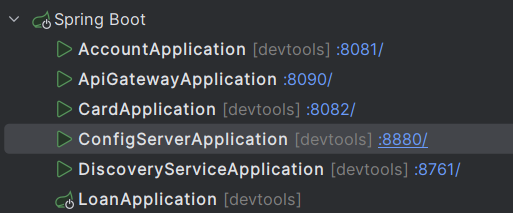

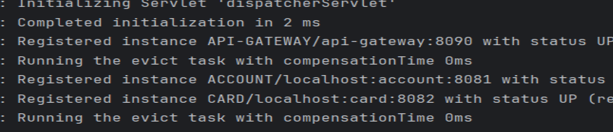

On doit utiliser l'url suivante pour créer un account après les modifications :

```url
http://localhost:8090/accounts
```

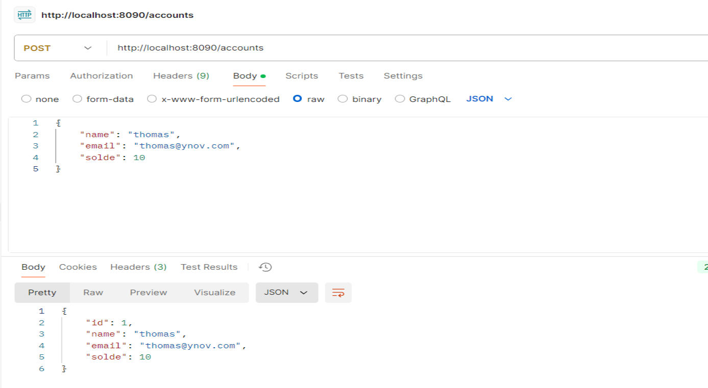

Après avoir créé un **Account**, si on crée une **Card**, voilà ce que ça donne :

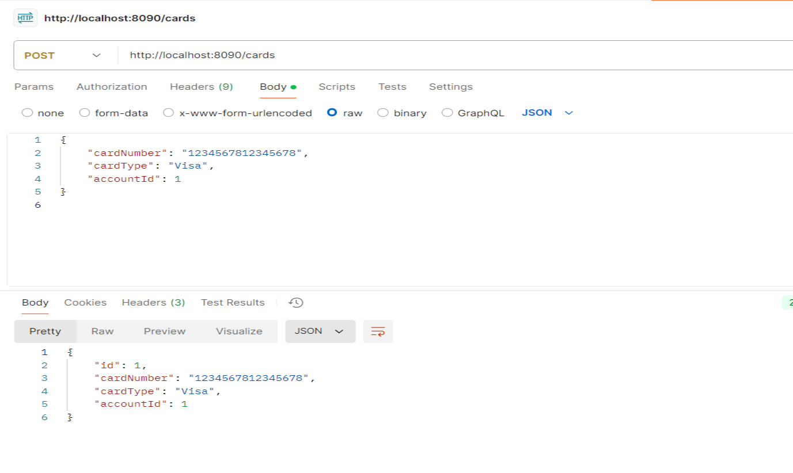

Si jamais, il n'existe pas de **Account** associé, alors ça donne ceci :

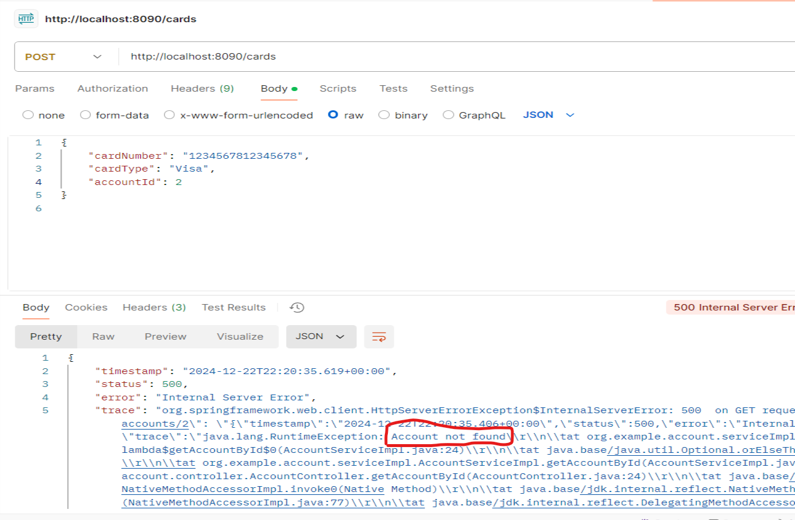

On peut remarquer sur l'image ci-dessus qu'avec un **accountId** égale à **2**, alors cela retourne une erreur 500 avec une **RuntimeException : Account not found.**

Après avoir vérifié ça, on peut commiter : tp-1 accountExist for CardService

Et maintenant, on peut appliquer le même code dans la partie **Loan**

#### Pour la partie **Loan**

##### Création du fichier **RestClientConfig**

Dans le service **Loan**, on doit créer un package **config** dans lequel on va créer un fichier **ResClientConfig.java**

```java
package org.example.card.config;

import org.springframework.boot.web.client.RestTemplateBuilder;
import org.springframework.cloud.client.loadbalancer.LoadBalanced;
import org.springframework.context.annotation.Bean;
import org.springframework.context.annotation.Configuration;
import org.springframework.web.client.RestTemplate;

@Configuration
public class RestClientConfig {
    @Bean
    @LoadBalanced
    public RestTemplate restTemplate(RestTemplateBuilder builder) {
        return builder.build();
    }
}
```

Ce fichier est rigoureusement le même que celui de **Card**

##### Création d'un fichier **ServiceClient** pour **Account**

Dans le service **Loan**, on doit créer un package **rest** dans lequel on va créer un fichier **AccountServiceClient.java**
```java
package org.example.loan.rest;

import org.springframework.beans.factory.annotation.Autowired;
import org.springframework.http.HttpStatus;
import org.springframework.http.ResponseEntity;
import org.springframework.stereotype.Service;
import org.springframework.web.client.HttpClientErrorException;
import org.springframework.web.client.RestTemplate;

@Service
public class AccountServiceClient {
private final RestTemplate restTemplate;
private final String accountServiceUrl = "http://account/accounts/";

    @Autowired
    public AccountServiceClient(RestTemplate restTemplate) {
        this.restTemplate = restTemplate;
    }
    public boolean accountExists(Long accountId) {
        try {
            ResponseEntity<String> response = restTemplate.getForEntity(accountServiceUrl + accountId, String.class);
            return response.getStatusCode() == HttpStatus.OK;
        } catch (HttpClientErrorException.NotFound e) {
            return false;
        }
    }
}
```

Ce fichier est rigoureusement le même que celui de **Card**

##### Modification de la fonction **saveLoan** dans **LoanServiceImpl**

Après avoir créé le service, on doit modifier la fonction de création de loan pour appliquer la méthode **accountExists** du **AccountServiceClient**.

Dans le fichier **LoanServiceImpl** :

On importe **AccountServiceClient** comme ceci :

```java
@Autowired
private AccountServiceClient accountServiceClient;
```

Puis, on modifie la fonction **saveLoan** pour appliquer la méthode **accountExist**, ce qui donne le code ci-dessous :

```java
@Override
public Loan saveLoan(Loan loan) {
    if (accountServiceClient.accountExists(loan.getAccountId())) {
        return loanRepository.save(loan);
    } else {
        throw new IllegalArgumentException("Account does not exist");
    }
}
```

La méthode est sensiblement la même que celle de **Card**, il faut juste remplacer **Card** par **Loan**

##### Test de la fonction **saveCard**

Maintenant, on peut tester la fonction pour voir si ça fonctionne :

Comme les services sont déjà lançés, il suffit de lancer **LoanService**, sinon relancer tous les services.
Il faut vérifier la config dans le discovery pour voir si le **LoanService** est bien lançé.

Il faut donc créer un **Account** comme précédemment et ensuite tester la création d'un **Loan**

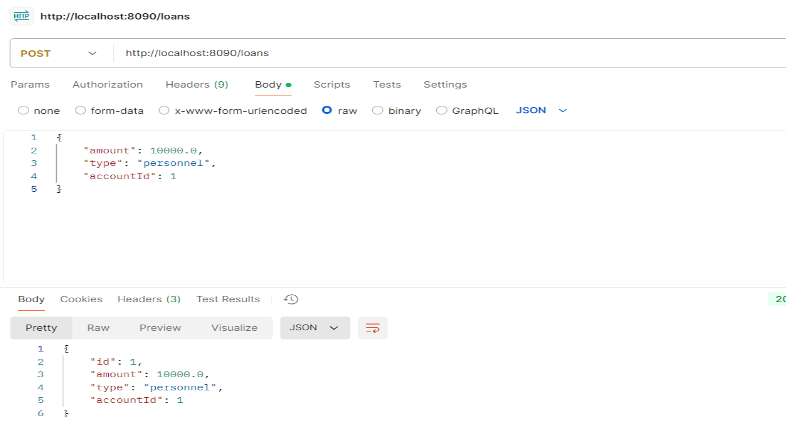

Si jamais, il n'existe pas de **Account** associé, alors ça donne ceci :

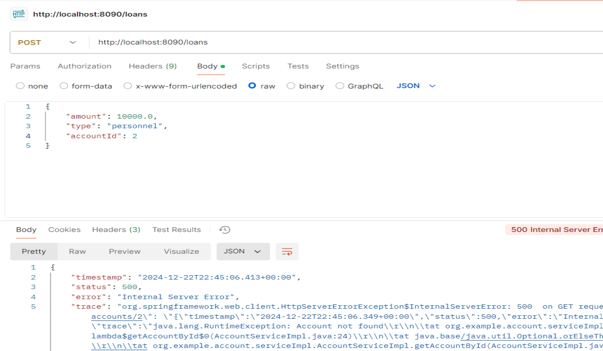

L'erreur indiquée est la même que pour **Card**

Après avoir vérifié ça, on peut commiter : tp-1 accountExist for LoanService

### Récupération de la liste des **Card** et des **Loan** dans un **Account**

#### Pour la partie **Account**

##### Création du fichier **RestClientConfig**

Comme pour les parties **Card** et **Loan**, on doit créer un package **config** dans lequel on va créer un fichier **ResClientConfig.java**

```java
package org.example.account.config;

import org.springframework.cloud.client.loadbalancer.LoadBalanced;
import org.springframework.context.annotation.Bean;
import org.springframework.context.annotation.Configuration;
import org.springframework.web.client.RestTemplate;

@Configuration
public class RestClientConfig {

    @Bean
    @LoadBalanced
    public RestTemplate restTemplate() {
        return new RestTemplate();
    }
}
```

La classe RestClientConfig définit un bean RestTemplate avec load balancing activé. Cela permet à l'application de réaliser des appels HTTP de manière équilibrée entre plusieurs instances de services enregistrés, typiquement dans un environnement microservices avec Spring Cloud.

Ensuite, on doit créer un package **dto**, dans lequel on doit créer les fichiers **CardDTO** et **LoanDTO** pour pouvoir les utiliser dans un autre fichier **AccountDTO** qu'on créera plus tard.

##### Création du fichier **CardDTO**
```java
package org.example.account.dto;

public class CardDTO {

    private Long id;


    private String cardNumber;


    private String cardType;


    private Long accountId;

    public Long getId() {
        return id;
    }

    public void setId(Long id) {
        this.id = id;
    }

    public String getCardNumber() {
        return cardNumber;
    }

    public void setCardNumber(String cardNumber) {
        this.cardNumber = cardNumber;
    }

    public String getCardType() {
        return cardType;
    }

    public void setCardType(String cardType) {
        this.cardType = cardType;
    }

    public Long getAccountId() {
        return accountId;
    }

    public void setAccountId(Long accountId) {
        this.accountId = accountId;
    }
}
```

##### Création du fichier **LoanDTO**
```java
package org.example.account.dto;

public class LoanDTO {
private Long id;
private Double amount;
private String type;
private Long accountId;

    public Long getId() {
        return id;
    }

    public void setId(Long id) {
        this.id = id;
    }

    public Double getAmount() {
        return amount;
    }

    public void setAmount(Double amount) {
        this.amount = amount;
    }

    public String getType() {
        return type;
    }

    public void setType(String type) {
        this.type = type;
    }

    public Long getAccountId() {
        return accountId;
    }

    public void setAccountId(Long accountId) {
        this.accountId = accountId;
    }
}
```

##### Création du fichier **ServiceClient**

On doit créer un package **Rest**, dans lequel on va créer un fichier **ServiceClient.java** qui va permettre de créer les fonctions permettant d'avoir la liste de **Card** et de **Loan** pour un **Account** 

```Java
package org.example.account.rest;

import org.example.account.dto.CardDTO;
import org.example.account.dto.LoanDTO;
import org.springframework.beans.factory.annotation.Autowired;
import org.springframework.core.ParameterizedTypeReference;
import org.springframework.http.HttpMethod;
import org.springframework.http.ResponseEntity;
import org.springframework.stereotype.Service;
import org.springframework.web.client.RestTemplate;

import java.util.Collections;
import java.util.List;

@Service
public class ServiceClient {
    private final RestTemplate restTemplate;
    private static final String CARD_SERVICE_URL = "http://card/cards/accounts/";
    private static final String LOAN_SERVICE_URL = "http://loan/loans/accounts/";
    
    @Autowired
    public ServiceClient(RestTemplate restTemplate) {
        this.restTemplate = restTemplate;
    }

    // This method retrieves a list of CardDTO objects associated with the given account ID
    // It sends an HTTP GET request to the Card Service and returns the list of cards
    // If there is an error (e.g., service unavailable), it returns an empty list
    public List<CardDTO> getCardsByAccountId(Long accountId) {
        try {
            ResponseEntity<List<CardDTO>> response = restTemplate.exchange(
                    CARD_SERVICE_URL + accountId,
                    HttpMethod.GET,
                    null,
                    new ParameterizedTypeReference<List<CardDTO>>() {});
            return response.getBody();
        } catch (Exception e) {

            return Collections.emptyList();
        }
    }

    // This method retrieves a list of LoanDTO objects associated with the given account ID
    // It sends an HTTP GET request to the Loan Service and returns the list of loans
    // If there is an error (e.g., service unavailable), it returns an empty list
    public List<LoanDTO> getLoansByAccountId(Long accountId) {
        try {
            ResponseEntity<List<LoanDTO>> response = restTemplate.exchange(
                    LOAN_SERVICE_URL + accountId,
                    HttpMethod.GET,
                    null,
                    new ParameterizedTypeReference<List<LoanDTO>>() {});
            return response.getBody();
        } catch (Exception e) {
            return Collections.emptyList();
        }
    }
}
```

##### Création du fichier **AccountDetailsDTO**

Dans le package **dto**, on va maintenant créer un fichier **AccountDetailsDTO.java**

```Java
package org.example.account.dto;

import lombok.Getter;
import lombok.Setter;

import java.util.List;

@Setter
@Getter
public class AccountDetailsDTO {
    // Getters and Setters
    private Long id;
    private String name;
    private String email;
    private Integer solde;
    private List<CardDTO> cards;
    private List<LoanDTO> loans;
    public Long getId() {
        return id;
    }
    public void setId(Long id) {
        this.id = id;
    }
    public String getName() {
        return name;
    }
    public void setName(String name) {
        this.name = name;
    }
    public String getEmail() {
        return email;
    }
    public void setEmail(String email) {
        this.email = email;
    }
    public Integer getSolde() {
        return solde;
    }
    public void setSolde(Integer solde) {
        this.solde = solde;
    }
    public List<CardDTO> getCards() {
        return cards;
    }
    public void setCards(List<CardDTO> cards) {
        this.cards = cards;
    }
    public List<LoanDTO> getLoans() {
        return loans;
    }
    public void setLoans(List<LoanDTO> loans) {
        this.loans = loans;
    }
}
```

Ce fichier contient les attributs de **Account** avec l'ajout des listes de **Card** et **Loan** en se basant sur les fichiers **DTO**.

Ensuite, on vient créer une fonction qui va permettre de récupérer les details de chaque **Account**.

##### Création de la méthode **getAccountDetails**

Donc, on crée d'abord la fonction dans **AccountService** : 

```Java
public AccountDetailsDTO getAccountDetails(Long accountId);
```
    
Puis, on va implémenter la méthode dans **AccountServiceImpl** : 

```Java
@Override
public AccountDetailsDTO getAccountDetails(Long accountId) {
    Account account = accountRepository.findById(accountId)
            .orElseThrow(() -> new RuntimeException("Account not found"));
    AccountDetailsDTO dto = new AccountDetailsDTO();
    dto.setId(account.getId());
    dto.setName(account.getName());
    dto.setEmail(account.getEmail());
    dto.setSolde(account.getSolde());
    dto.setCards(serviceClient.getCardsByAccountId(accountId));
    dto.setLoans(serviceClient.getLoansByAccountId(accountId));
    return dto;
}
```

Pour la création de cette méthode, il ne faut pas oublier d'ajouter le **serviceClient** dans le fichier via : 

```Java
public AccountDetailsDTO getAccountDetails(Long accountId);
```

##### Création des méthodes **ByAccountId**

Dans la partie **Card** : 

Ajoutez la méthode **findByAccountId** dans le **CardRepository**
```Java
List<Card>findByAccountId(Long accountId);
```

Déclarer une méthode **getCardsByAccountId** dans le **CardService** 
```Java
public List<Card> getCardsByAccountId(Long accountId);
```

Implementer la méthode dans le **CardServiceImpl** avec la méthode du Repository
```Java
@Override
public List<Card> getCardsByAccountId(Long accountId) {
    return cardRepository.findByAccountId(accountId);
}
```

Il faut appliquer la même chose dans la partie **Loan**

Ajoutez la méthode **findByAccountId** dans le **LoanRepository**
```Java
List<Loan>findByAccountId(Long accountId);
```

Déclarer une méthode **getLoansByAccountId** dans le **LoanService**
```Java
public List<Loan> getLoansByAccountId(Long accountId);
```

Implementer la méthode dans le **LoanServiceImpl** avec la méthode du Repository
```Java
@Override
public List<Loan> getLoansByAccountId(Long accountId) {
    return loanRepository.findByAccountId(accountId);
}
```

On doit maintenant appliquer un endpoint, dans le **CardController** par exemple :

```Java
@GetMapping("/accounts/{accountId}")
public List<Card> getCardsByAccountId(@PathVariable Long accountId) {
    return cardService.getCardsByAccountId(accountId);
}
```

Faire la même chose dans **LoanController** : 

```Java
@GetMapping("/accounts/{accountId}")
public List<Loan> getLoansByAccountId(@PathVariable Long accountId) {
    return loanService.getLoansByAccountId(accountId);
}
```

Après avoir testé les méthodes de retour **ByAccount**, on peut maintenant tester de renvoyer un **Account** avec la liste de **Card** et **Loan**

##### Création de l'endPoint dans le **AccountController**

Après avoir créé la méthode, il faut créer un **endPoint** dans le controller qui appelle la méthode **getAccountDetails** :

```Java
@GetMapping("/{id}/details")
public AccountDetailsDTO getAccountDetails(@PathVariable Long id) {
    return accountService.getAccountDetails(id);
}
```

Il faut maintenant appliquer des tests pour vérifier si l'**endPoint** fonctionne.

Après avoir créé un **Account**, une **Card** et un **Loan**, on peut tester le get suivant : 

```url
http://localhost:8090/accounts/1/details
```

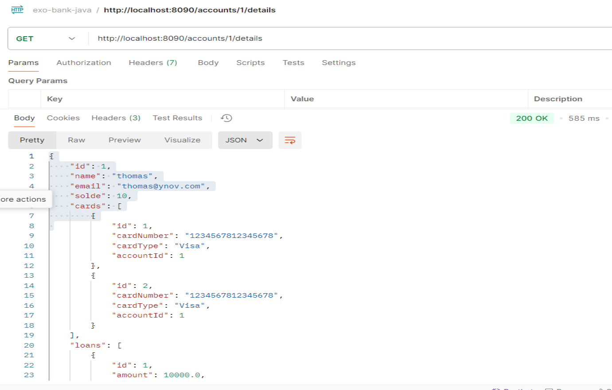

Dans l'image ci-dessus, on peut voir qu'on reçoit bien la liste de **Card** et de **Loan** lié à **l'Account.**

**Avec ça on a donc terminé le TP_1.**

On peut donc faire un commit : **accountDetails TP1**


